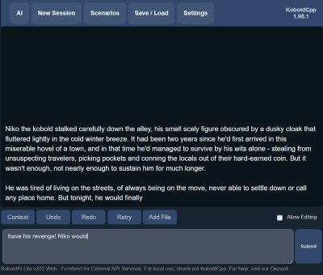
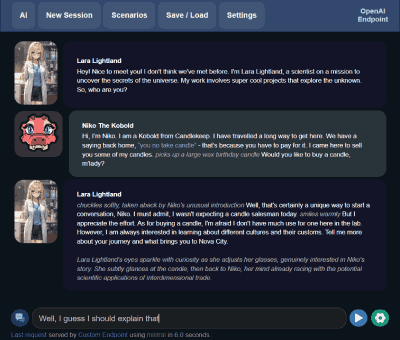
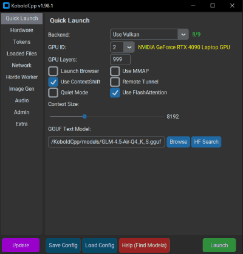
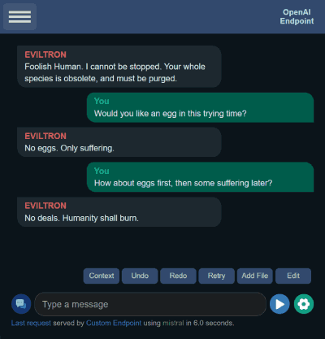

# Esobold (Esolithe's fork of KoboldCPP)


Welcome all, this fork focuses on enhanced remote management, server saving and integration in KoboldCPP and Kobold Lite.  Release can be found [here](https://github.com/esolithe/esobold/releases).

It offers the following functionalities:
- Config reloading (Cedo's implementation) enhanced with an option to select a text model to override the config (useful to switch between models using a generic "8B" or "12B" config without needing one for each model).  There is also helper text in Lite to show you the current config and model in use, along with a waiting mechanism to only reload when it's ready.


- Support for downloading models from HF through the UI (based on Cedo's implementation for the launcher) - To use this please tick the box under the admin tab in the launcher, and also ensure you run the exe from the directory where you store your models.


- Save / load from server - with or without admin password: It is possible to store saves, scenarios, character cards, lorebooks etc.  The difference with the main KCPP is this option integrates with the scenerio search, offers the ability to upload multiple types of content and does not limit the amount of save uploaded.  Both options can be used together if desired.


- Data on the server can be assigned a thumbnail


- Server save data can be accessed in the scenarios tab (allowing searching by types and names)


- Agent thinking (based on prompts from this cool project [here](https://github.com/Wladastic/mini_autogpt))
- Improvements to TextDB, such as VectorDB (embedding) support and document support (including upload of text documents, PDFs (Vic49 / SevenOf9 wrote the parser), OCR using the vision model loaded, and transcription from audio)
- Export / Import of WI groups from files


- Addition of [BlackLite-Tools](https://github.com/PeterPeet/BlackLite-Tools/tree/BlackLite-UICustomizationTool) by Peter for UI styling with a few UX tweaks (open / close tool, saving of themes through reloads, autoload of last theme on opening etc) - this can be found under the advanced settings

## Agent thinking mode (experimental)

An attempt to replicate tool usage / agent logic in Lite.  Essentially, the AI is provided the user input and a list of tools that it can use.  Should work on all UI modes for instruct, along with supporting chat names.

The currently supported options include:
- Sending messages / Asking for additional user input (including AI suggested options like a text adventure)


- Searching the web


- Evaluating mathematical formulas
- Rolling dice (can be used for random generation)


- Generating images at different aspect ratios (in KCPP) - Both from text and another image


- Analysing images (in KCPP)
- "Speaking" through TTS (in KCPP)
- Adding data to the TextDB and searching for information in it, along with the chat log
- Knowing the current date
- Enabling a word count on the AI responses
- Supports system prompts, both using and setting it automatically
- Supports setting a "state" parameter which is always inserted at the end of the text.  It is also possible to define the format that the response must use (i.e. {health: 10, mana: 20...})
- Support enforcing a specific action order (i.e. the agent can be set to always roll a dice, then send a response)
- Support for manually preventing the agent from taking specific actions:

```
[DOCUMENT BREAK][Forbidden agent commands]ask_user|roll_dice[DOCUMENT BREAK]
```

- Support for randomly selecting elements from a list of items.  The lists can be defined in the TextDB with:

```
[DOCUMENT BREAK][Table:Genres]Action Fantasy
Horror[DOCUMENT BREAK]
```

- Support for automatically switching models and configs for agent tasks (image gen, image analysis, speech etc) - the text should be "command name::config file::model file".  Multiple overrides can be stored by using "|" to separate them.

```
[DOCUMENT BREAK][Agent config overrides]send_message::12b.kcpps[DOCUMENT BREAK]
```

A full list of the names for enabled commands can be found with the command below in the browser console:

```
getEnabledCommands().map(c => c.name)
```

Using this function requires the following conditions to be met:
- Use an instruct model
- Use separate start and end tags for all roles (tick the option under the instruct settings and ensure they are all filled out, like ChatML)
- Ensure that if you wish the AI to use web searching, TTS or image gen that the respective options are configured and enabled in the UI

## Improvements to TextDB (probably will be upstreamed in the future)
- UI improvements


- Importing of lorebooks from the load button as Text DB entries
- Support for ```[DOCUMENT BREAK][Name of document]This is the content of the document``` which allows for user defined groupings of sections
- Support for embedding models running in KCPP - Embeddings are generated on the server based on the text DB content, and then stored in the browser (notification indicates progress - can take some time).


- Upload document support (including upload of text documents, lorebooks, PDFs (Vic49 / SevenOf9 wrote the parser), OCR using the vision model loaded, and transcription from audio)
- Export / Import of WI groups from files
- Addition of search query and chunk prefix support

## Running the fork

Most of the settings are identical to KoboldCPP, but there's a couple of additional options to note in the launcher (admin tab) - admin must be enabled for these to work:
- Model directory: A folder with text model GGUFs you wish to allow switching between - this is an override on top of using a config, so please ensure a config directory is set as well.
- Data directory: A folder server side data is stored (for example saves, character cards etc).


If you prefer the arguments:
- To turn on remote management: --admin
- To set a management password: --adminpassword "..."
- To set the reloadable configs directory --admindir "..."
- To set the reloadable models directory (overriding the config model): --admintextmodelsdir "..."
- To sets the data storage directory (where the database storing server side saves are stored): --admindatadir "..."

---

# koboldcpp

KoboldCpp is an easy-to-use AI text-generation software for GGML and GGUF models, inspired by the original **KoboldAI**. It's a single self-contained distributable that builds off **llama.cpp** and adds many additional powerful features. [Download Releases Here](https://github.com/LostRuins/koboldcpp/releases/latest).







### Features
- Single file executable, with no installation required and no external dependencies
- Runs on CPU or GPU, supports full or partial offloaded
- LLM text generation (Supports all GGML and GGUF models, backwards compatibility with ALL past models)
- Image Generation and Image Editing (Stable Diffusion 1.5, SDXL, SD3, Flux, Qwen Image, Z-Image, Klein)
- Video Generation (WAN 2.2)
- Speech-To-Text (Voice Recognition) via Whisper
- Text-To-Speech (Voice Generation) via Qwen3TTS, Kokoro, OuteTTS, Parler and Dia
- Music Generation (Ace Step 1.5)
- Image Recognition (Multimodal Vision)
- MCP Server support and tool calling
- Provides many compatible APIs endpoints for many popular webservices (KoboldCppApi OpenAiApi OllamaApi A1111ForgeApi ComfyUiApi WhisperTranscribeApi XttsApi OpenAiSpeechApi)
- Bundled KoboldAI Lite UI with editing tools, save formats, memory, world info, author's note, characters, scenarios.
- Includes multiple modes (chat, adventure, instruct, storywriter) and UI Themes (aesthetic roleplay, classic writer, corporate assistant, messsenger)
- Supports loading Tavern Character Cards, importing many different data formats from various sites, reading or exporting JSON savefiles and persistent stories.
- Many other features including new samplers, regex support, websearch, RAG via TextDB, image recognition/vision and more.
- Ready-to-use binaries for Windows, MacOS, Linux. Runs directly with Colab, Docker, also supports other platforms if self-compiled (like  Android (via Termux) and Raspberry PI).
- [Need help finding a model? Read this!](https://github.com/LostRuins/koboldcpp/wiki#getting-an-ai-model-file)

## Windows Usage (Precompiled Binary, Recommended)
- Windows binaries are provided in the form of **koboldcpp.exe**, which is a pyinstaller wrapper containing all necessary files. **[Download the latest koboldcpp.exe release here](https://github.com/LostRuins/koboldcpp/releases/latest)**
- To run, simply execute **koboldcpp.exe**.
- Launching with no command line arguments displays a GUI containing a subset of configurable settings. Generally you dont have to change much besides the `Presets` and `GPU Layers`. Read the `--help` for more info about each settings.
- Obtain and load a GGUF model. See [here](#Obtaining-a-GGUF-model)
- By default, you can connect to http://localhost:5001
- You can also run it using the command line. For info, please check `koboldcpp.exe --help`

## Linux Usage (Precompiled Binary, Recommended)
On modern Linux systems, you should download the `koboldcpp-linux-x64` prebuilt PyInstaller binary on the **[releases page](https://github.com/LostRuins/koboldcpp/releases/latest)**. Simply download and run the binary (You may have to `chmod +x` it first). If you have an older device, you can also try the `koboldcpp-linux-x64-oldpc` instead for greatest compatibility.

Alternatively, you can also install koboldcpp to the current directory by running the following terminal command:
```
curl -fLo koboldcpp https://github.com/LostRuins/koboldcpp/releases/latest/download/koboldcpp-linux-x64-oldpc && chmod +x koboldcpp
```
After running this command you can launch Koboldcpp from the current directory using `./koboldcpp` in the terminal (for CLI usage, run with `--help`).
Finally, obtain and load a GGUF model. See [here](#Obtaining-a-GGUF-model)

## MacOS (Precompiled Binary)
- PyInstaller binaries for Modern ARM64 MacOS (M1, M2, M3) are now available! **[Simply download the MacOS binary](https://github.com/LostRuins/koboldcpp/releases/latest)**
- In a MacOS terminal window, set the file to executable `chmod +x koboldcpp-mac-arm64` and run it with `./koboldcpp-mac-arm64`.
- In newer MacOS you may also have to whitelist it in security settings if it's blocked. [Here's a video guide](https://youtube.com/watch?v=NOW5dyA_JgY).
- Alternatively, or for older x86 MacOS computers, you can clone the repo and compile from source code, see Compiling for MacOS below.
- Finally, obtain and load a GGUF model. See [here](#Obtaining-a-GGUF-model)

## Run on Colab
- KoboldCpp now has an **official Colab GPU Notebook**! This is an easy way to get started without installing anything in a minute or two. [Try it here!](https://colab.research.google.com/github/LostRuins/koboldcpp/blob/concedo/colab.ipynb).
- Note that KoboldCpp is not responsible for your usage of this Colab Notebook, you should ensure that your own usage complies with Google Colab's terms of use.

## Run on RunPod
- KoboldCpp can now be used on RunPod cloud GPUs! This is an easy way to get started without installing anything in a minute or two, and is very scalable, capable of running 70B+ models at afforable cost. [Try our RunPod image here!](https://koboldai.org/runpodcpp). Alternatively, you can also try [SimplePod](https://koboldai.org/simplepod) for smaller models

## Docker
- Caution: The KoboldCpp docker is intended for experts only, and primarily intended for cloud GPU rental users! If you're NOT an experienced user, you're recommended to use the [precompiled binaries directly instead](https://github.com/LostRuins/koboldcpp/releases/latest)
- The docker uses a x86-64 Ubuntu Linux based environment interally, and expects a Nvidia or AMD GPU. It may perform suboptimally on some Windows and MacOS devices, and may outright fail for ARM. It applies crude AVX/AVX2 feature detection which may not work correctly on all systems, resulting in the failsafe binaries being loaded (speed will become extremely slow).
- If you still want to proceed, the official docker can be found at https://hub.docker.com/r/koboldai/koboldcpp

## Obtaining a GGUF model
- KoboldCpp uses GGUF models. They are not included with KoboldCpp, but you can download GGUF files from other places such as [Bartowski's Huggingface](https://huggingface.co/bartowski). Search for "GGUF" on huggingface.co for plenty of compatible models in the `.gguf` format.
- For beginners, we recommend [Qwen3-VL-8B](https://huggingface.co/unsloth/Qwen3-VL-8B-Instruct-GGUF/resolve/main/Qwen3-VL-8B-Instruct-Q4_K_S.gguf) **(Most Recommended, best all rounder model)**
- For creative writing and roleplay, you can try [L3-8B-Stheno-v3.2](https://huggingface.co/bartowski/L3-8B-Stheno-v3.2-GGUF/resolve/main/L3-8B-Stheno-v3.2-Q4_K_S.gguf) (old, smaller and weaker) or [Tiefighter 13B](https://huggingface.co/KoboldAI/LLaMA2-13B-Tiefighter-GGUF/resolve/main/LLaMA2-13B-Tiefighter.Q4_K_S.gguf) (old but very versatile model).
- [Alternatively, you can download the tools to convert models to the GGUF format yourself here](https://kcpptools.concedo.workers.dev). Run `convert-hf-to-gguf.py` to convert them, then `quantize_gguf.exe` to quantize the result.
- Other models for Whisper (speech recognition), Image Generation, Text to Speech or Image Recognition [can be found on the Wiki](https://github.com/LostRuins/koboldcpp/wiki#what-models-does-koboldcpp-support-what-architectures-are-supported)

## Improving Performance
- **GPU Acceleration**: If you're on Windows with an Nvidia GPU you can get CUDA support out of the box using the `--usecuda`  flag (Nvidia Only), or `--usevulkan` (Any GPU), make sure you select the correct .exe with CUDA support.
- **GPU Layer Offloading**: Add `--gpulayers` to offload model layers to the GPU. The more layers you offload to VRAM, the faster generation speed will become. Experiment to determine number of layers to offload, and reduce by a few if you run out of memory.
- **Increasing Context Size**: Use `--contextsize (number)` to increase context size, allowing the model to read more text. Note that you may also need to increase the max context in the KoboldAI Lite UI as well (click and edit the number text field).
- **Old CPU Compatibility**: If you are having crashes or issues, you can try running in a non-avx2 compatibility mode by adding the `--noavx2` flag. You can also try reducing your `--blasbatchssize` (set -1 to avoid batching)

For more information, be sure to run the program with the `--help` flag, or **[check the wiki](https://github.com/LostRuins/koboldcpp/wiki).**

## Compiling KoboldCpp From Source Code

### Compiling on Linux (Using koboldcpp.sh automated compiler script)
when you can't use the precompiled binary directly, we provide an automated build script which uses conda to obtain all dependencies, and generates (from source) a ready-to-use a pyinstaller binary for linux users.
- Clone the repo with `git clone https://github.com/LostRuins/koboldcpp.git`
- Simply execute the build script with `./koboldcpp.sh dist` and run the generated binary. (Not recommended for systems that already have an existing installation of conda. Dependencies: curl, bzip2)
```
./koboldcpp.sh # This launches the GUI for easy configuration and launching (X11 required).
./koboldcpp.sh --help # List all available terminal commands for using Koboldcpp, you can use koboldcpp.sh the same way as our python script and binaries.
./koboldcpp.sh rebuild # Automatically generates a new conda runtime and compiles a fresh copy of the libraries. Do this after updating Koboldcpp to keep everything functional.
./koboldcpp.sh dist # Generate your own precompiled binary (Due to the nature of Linux compiling these will only work on distributions equal or newer than your own.)
```

### Compiling on Linux (Manual Method)
- To compile your binaries from source, clone the repo with `git clone https://github.com/LostRuins/koboldcpp.git`
- A makefile is provided, simply run `make` (when compiling, you can set the number of parallel jobs with the `-j` flag).
- Optional Vulkan: Link your own install of Vulkan SDK manually with `make LLAMA_VULKAN=1`
- You can attempt a CuBLAS build with `LLAMA_CUBLAS=1`, (or `LLAMA_HIPBLAS=1` for AMD). You will need CUDA Toolkit installed. Some have also reported success with the CMake file, though that is more for windows.
- For a full featured build (all backends), do `make LLAMA_CUBLAS=1 LLAMA_VULKAN=1`. (Note that `LLAMA_CUBLAS=1` will not work on windows, you need visual studio)
- To make your build sharable and capable of working on other devices, you must use `LLAMA_PORTABLE=1`
- After all binaries are built, you can run the python script with the command `python koboldcpp.py [ggml_model.gguf] [port]`

### Compiling on Windows
- You're encouraged to use the .exe released, but if you want to compile your binaries from source at Windows, the easiest way is:
  - Get the latest release of w64devkit (https://github.com/skeeto/w64devkit). Be sure to use the "vanilla one", not i686 or other different stuff. If you try they will conflit with the precompiled libs!
  - Clone the repo with `git clone https://github.com/LostRuins/koboldcpp.git`
  - Make sure you are using the w64devkit integrated terminal, then run `make` at the KoboldCpp source folder. This will create the .dll files for a pure CPU native build (when compiling, you can set the number of parallel jobs with the `-j` flag).
  - For a GPU build (all backends), do `make LLAMA_VULKAN=1`. (Note that `LLAMA_CUBLAS=1` will not work on windows, you need visual studio)
  - To make your build sharable and capable of working on other devices, you must use `LLAMA_PORTABLE=1`
  - If you want to generate the .exe file, make sure you have the python module PyInstaller installed with pip (`pip install PyInstaller`). Then run the script `make_pyinstaller.bat`
  - The koboldcpp.exe file will be at your dist folder.
- **Building with CUDA**: Visual Studio, CMake and CUDA Toolkit is required. Clone the repo, then open the CMake file and compile it in Visual Studio. Copy the `koboldcpp_cublas.dll` generated into the same directory as the `koboldcpp.py` file. If you are bundling executables, you may need to include CUDA dynamic libraries (such as `cublasLt64_11.dll` and `cublas64_11.dll`) in order for the executable to work correctly on a different PC.
- **Replacing Libraries (Not Recommended)**: If you wish to use your own version of the additional Windows libraries (Vulkan), you can do it with:
  - Move the respectives .lib files to the /lib folder of your project, overwriting the older files.
  - Also, replace the existing versions of the corresponding .dll files located in the project directory root.
  - Make the KoboldCpp project using the instructions above.

### Compiling on MacOS
- You can compile your binaries from source. You can clone the repo with `git clone https://github.com/LostRuins/koboldcpp.git`
- A makefile is provided, simply run `make` (when compiling, you can set the number of parallel jobs with the `-j` flag).
- If you want Metal GPU support, instead run `make LLAMA_METAL=1`, note that MacOS metal libraries need to be installed.
- To make your build sharable and capable of working on other devices, you must use `LLAMA_PORTABLE=1`
- After all binaries are built, you can run the python script with the command `python koboldcpp.py --model [ggml_model.gguf]` (and add `--gpulayers (number of layer)` if you wish to offload layers to GPU).

### Compiling on OpenBSD
- Clone the repo with `git clone https://github.com/LostRuins/koboldcpp.git`
- the project uses Gnu Makefile format, so you will need gmake: `pkg_add gmake`
- compiling vulkan support
  - you will require libvulkan, this is included in the vulkan-loader package, which is a dependency of the vulkan-tools package: `pkg_add vulkan-tools` or `pkg_add vulkan-loader`
  - you will require glslc, this is incliuded in the shaderc package: `pkg_add shaderc`
  - if your gmake terminates with "fatal error: 'ggml-vulkan-shaders.hpp' file not found" the problem is probably that glslc is not installed. See above.
  - OpenBSD's default datasize limit may prevent compiliation `ulimit -d 8388608` should work
  - compile using `gmake LLAMA_VULKAN=1`
- After all binaries are built, you can run the python script with the command `python3 koboldcpp.py --model [ggml_model.gguf]`

### Compiling on Android (Termux Installation)
- [First, Install and run Termux from F-Droid](https://f-droid.org/en/packages/com.termux/)
## Termux Quick Setup Script (Easy Setup)
- You can use this auto-installation script to quickly install and build everything and launch KoboldCpp with a model.
Simply run:
```
curl -sSL https://raw.githubusercontent.com/esolithe/esobold/refs/heads/remoteManagement/android_install.sh | sh
```
and it will install everything required. Alternatively, you can download the above `android_install.sh` script to file, then do `chmod +x` and run it interactively.
## Termux Manual Instructions (DIY Setup)
- Open termux and run the command `apt update`
- Install dependency `apt install openssl`
- Install other dependencies with `pkg install wget git python`
- Run `pkg upgrade`
- Clone the repo `git clone https://github.com/LostRuins/koboldcpp.git`
- Navigate to the koboldcpp folder `cd koboldcpp`
- Build the project `make`
- To make your build sharable and capable of working on other devices, you must use `LLAMA_PORTABLE=1`, this disables usage of ARM instrinsics.
- Grab a small GGUF model, such as `wget https://huggingface.co/concedo/KobbleTinyV2-1.1B-GGUF/resolve/main/KobbleTiny-Q4_K.gguf`
- Start the python server `python koboldcpp.py --model KobbleTiny-Q4_K.gguf`
- Connect to `http://localhost:5001` on your mobile browser
- If you encounter any errors, make sure your packages are up-to-date with `pkg up` and `pkg upgrade`
- If you have trouble installing an dependency, you can try the command `termux-change-repo` and choose a different repo (e.g. `Mirror by BFSU`)
- GPU acceleration for Termux may be possible but I have not explored it. If you find a good cross-device solution, do share or PR it.

## AMD Users
- For most users, you can get very decent speeds by selecting the **Vulkan** option instead, which supports both Nvidia and AMD GPUs.
- Alternatively, you can try the ROCM fork at https://github.com/YellowRoseCx/koboldcpp-rocm though this may be outdated.

## Third Party Resources
- These unofficial resources have been contributed by the community, and may be outdated or unmaintained. No official support will be provided for them!
  - Arch Linux Packages: [CUBLAS](https://aur.archlinux.org/packages/koboldcpp-cuda), and [HIPBLAS](https://aur.archlinux.org/packages/koboldcpp-hipblas).
  - Unofficial Dockers: [korewaChino](https://github.com/korewaChino/koboldCppDocker) and [noneabove1182](https://github.com/noneabove1182/koboldcpp-docker)
  - Nix & NixOS: KoboldCpp is available on Nixpkgs and can be installed by adding just `koboldcpp` to your `environment.systemPackages` *(or it can also be placed in `home.packages`)*.
    - [Example Nix Setup and further information](examples/nix_example.md)
    - If you face any issues with running KoboldCpp on Nix, please open an issue [here](https://github.com/NixOS/nixpkgs/issues/new?assignees=&labels=0.kind%3A+bug&projects=&template=bug_report.md&title=).
- [GPTLocalhost](https://gptlocalhost.com/demo#KoboldCpp) - KoboldCpp is supported by GPTLocalhost, a local Word Add-in for you to use KoboldCpp in Microsoft Word. A local alternative to "Copilot in Word."

## Questions and Help Wiki
- **First, please check out [The KoboldCpp FAQ and Knowledgebase](https://github.com/LostRuins/koboldcpp/wiki) which may already have answers to your questions! Also please search through past issues and discussions.**
- If you cannot find an answer, open an issue on this github, or find us on the [KoboldAI Discord](https://koboldai.org/discord).

## KoboldCpp and KoboldAI API Documentation
- [Documentation for KoboldAI and KoboldCpp endpoints can be found here](https://lite.koboldai.net/koboldcpp_api)

## KoboldCpp Public Demo
- [A public KoboldCpp demo can be found at our Huggingface Space. Please do not abuse it.](https://koboldai-koboldcpp-tiefighter.hf.space/)

## Considerations
- For Windows: No installation, single file executable, (It Just Works)
- Since v1.15, requires CLBlast if enabled, the prebuilt windows binaries are included in this repo. If not found, it will fall back to a mode without CLBlast.
- Since v1.33, you can set the context size to be above what the model supports officially. It does increases perplexity but should still work well below 4096 even on untuned models. (For GPT-NeoX, GPT-J, and Llama models) Customize this with `--ropeconfig`.
- Since v1.42, supports GGUF models for LLAMA and Falcon
- Since v1.55, lcuda paths on Linux are hardcoded and may require manual changes to the makefile if you do not use koboldcpp.sh for the compilation.
- Since v1.60, provides native image generation with StableDiffusion.cpp, you can load any SD1.5 or SDXL .safetensors model and it will provide an A1111 compatible API to use.
- **I try to keep backwards compatibility with ALL past llama.cpp models**. But you are also encouraged to reconvert/update your models if possible for best results.
- Since v1.75, openblas has been deprecated and removed in favor of the native CPU implementation.
- Since v1.107, CLBlast has been deprecated and removed in favor of Vulkan.
- Phishing SCAM Warning: koboldcpp(dot)com is NOT an official site, please help to report it to google for impersonation. You should ONLY trust official downloads from the release binaries on the official github at https://github.com/LostRuins/koboldcpp/releases/latest

## License
- The original GGML library, stable-diffusion.cpp and llama.cpp by ggerganov are licensed under the MIT License
- However, KoboldAI Lite is licensed under the AGPL v3.0 License
- KoboldCpp code and other files are also under the AGPL v3.0 License unless otherwise stated
- Llama.cpp source repo is at https://github.com/ggml-org/llama.cpp (MIT)
- Stable-diffusion.cpp source repo is at https://github.com/leejet/stable-diffusion.cpp (MIT)
- TTS.cpp source repo is at https://github.com/mmwillet/TTS.cpp (MIT)
- Qwen3TTS source repo is at https://github.com/predict-woo/qwen3-tts.cpp (MIT)
- AceStep.cpp source repo is at https://github.com/ServeurpersoCom/acestep.cpp (MIT)
- KoboldCpp source repo is at https://github.com/LostRuins/koboldcpp (AGPL)
- KoboldAI Lite source repo is at https://github.com/LostRuins/lite.koboldai.net (AGPL)
- For any further enquiries, contact @concedo on discord, or LostRuins on github.

## Notes
- If you wish, after building the koboldcpp libraries with `make`, you can rebuild the exe yourself with pyinstaller by using `make_pyinstaller.bat`
- API documentation available at `/api` (e.g. `http://localhost:5001/api`) and https://lite.koboldai.net/koboldcpp_api. An OpenAI compatible API is also provided at `/v1` route (e.g. `http://localhost:5001/v1`).
- **All up-to-date GGUF models are supported**, and KoboldCpp also includes backward compatibility for older versions/legacy GGML `.bin` models, though some newer features might be unavailable.
- An incomplete list of architectures is listed, but there are *many hundreds of other GGUF models*. In general, if it's GGUF, it should work.
- Llama / Llama2 / Llama3 / Alpaca / GPT4All / Vicuna / Koala / Pygmalion / Metharme / WizardLM / Mistral / Mixtral / Miqu / Qwen / Qwen2 / Yi / Gemma / Gemma2 / GPT-2 / Cerebras / Phi-2 / Phi-3 / GPT-NeoX / Pythia / StableLM / Dolly / RedPajama / GPT-J / RWKV4 / MPT / Falcon / Starcoder / Deepseek and many, **many** more.

# Where can I download AI model files?
- The best place to get GGUF text models is huggingface. For image models, CivitAI has a good selection. Here are some to get started.
  - Text Generation: [L3-8B-Stheno-v3.2](https://huggingface.co/bartowski/L3-8B-Stheno-v3.2-GGUF/resolve/main/L3-8B-Stheno-v3.2-Q4_K_S.gguf) (smaller and weaker) or [Tiefighter 13B](https://huggingface.co/KoboldAI/LLaMA2-13B-Tiefighter-GGUF/resolve/main/LLaMA2-13B-Tiefighter.Q4_K_S.gguf) (old but very versatile model) or [Gemma-3-27B Abliterated](https://huggingface.co/mlabonne/gemma-3-27b-it-abliterated-GGUF/resolve/main/gemma-3-27b-it-abliterated.q4_k_m.gguf) (largest and most powerful)
  - Image Generation: [Anything v3](https://huggingface.co/admruul/anything-v3.0/resolve/main/Anything-V3.0-pruned-fp16.safetensors) or [Deliberate V2](https://huggingface.co/Yntec/Deliberate2/resolve/main/Deliberate_v2.safetensors) or [Dreamshaper SDXL](https://huggingface.co/Lykon/dreamshaper-xl-v2-turbo/resolve/main/DreamShaperXL_Turbo_v2_1.safetensors)
  - Image Recognition MMproj: [Pick the correct one for your model architecture here](https://huggingface.co/koboldcpp/mmproj/tree/main)
  - Speech Recognition: [Whisper models for Speech-To-Text](https://huggingface.co/koboldcpp/whisper/tree/main)
  - Text-To-Speech: [TTS models for Narration](https://huggingface.co/koboldcpp/tts/tree/main)
